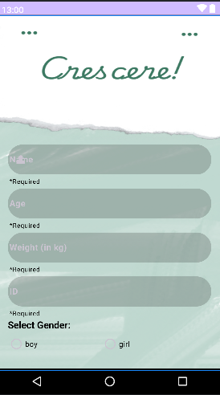
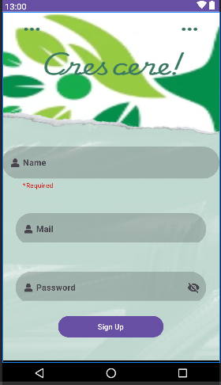
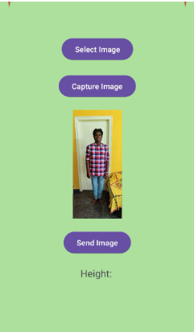
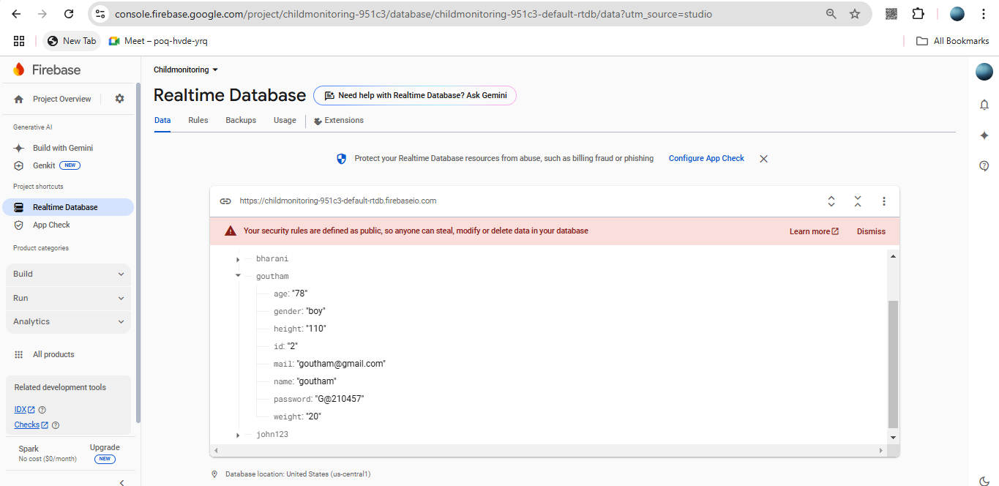
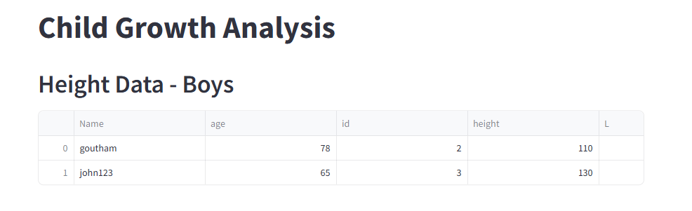
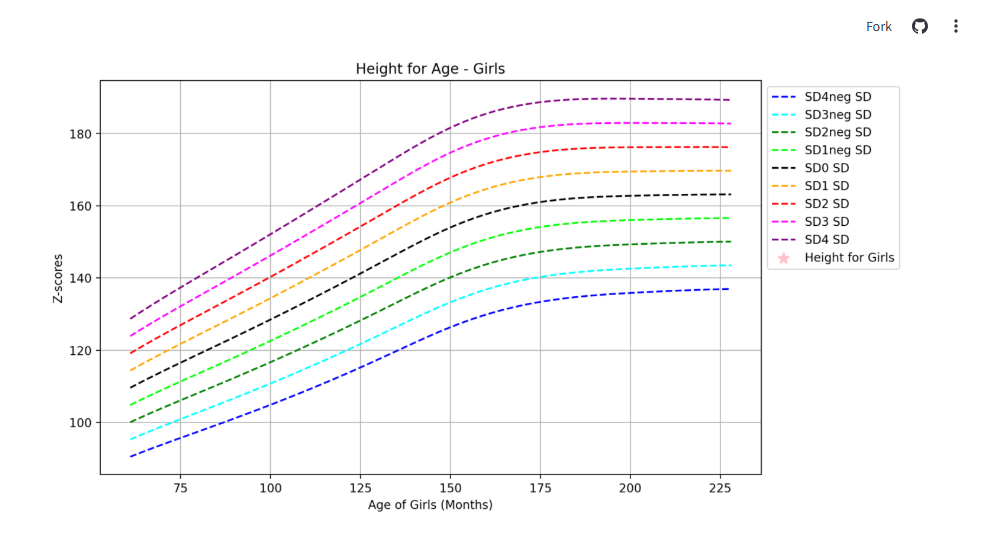

# Crescere-Child-Monitoring-App
README: Child Health Monitoring App-Crescere
Overview
The Child Health Monitoring App is a comprehensive solution for monitoring the health of children. It collects key details like name, gender, weight, and height, calculates z-scores, and generates insights on health parameters like stunting and wasting. This data is securely stored in Firebase and visualized through a web dashboard for doctors to assess and track child health metrics.
________________________________________
Key Features
1.	User Details Collection:
o	Collects the child’s name, gender, weight, and other vital details.
2.	Height Detection:
o	Measures and captures the child’s height using a camera or sensor.
3.	Data Synchronization with Firebase:
o	Stores all the collected data in Firebase for secure and scalable access.
4.	Data Visualization:
o	Fetches data from Firebase and sends it to the connected web dashboard.
o	Generates graphs of z-scores to provide insights into:
	Stunting: Low height-for-age.
	Wasting: Low weight-for-height.
5.	Doctor’s Dashboard:
o	Doctors can view and analyze the z-score graphs to monitor the child's health trends effectively.
________________________________________
Technologies Used
•	Mobile App: Developed using Kotlin for Android.
•	Backend: Firebase for real-time database and storage.
•	Web Dashboard: Developed with modern web technologies (streamlit)
________________________________________
How It Works
1.	Step 1: User inputs basic details (name, gender, weight).
2.	Step 2: The app measures and captures the height.
3.	Step 3: The collected data is sent to Firebase.
4.	Step 4: Firebase data is fetched and visualized on the web dashboard.
5.	Step 5: Z-score graphs are plotted to determine health metrics, providing doctors with actionable insights.
________________________________________
Usage
1.	Setup Firebase:
o	Configure Firebase Realtime Database and Firebase Storage.
2.	Run the App:
o	Install the app on an Android device and input child details.
3.	Web Dashboard:
o	Open the dashboard to access visualized health metrics.

      
